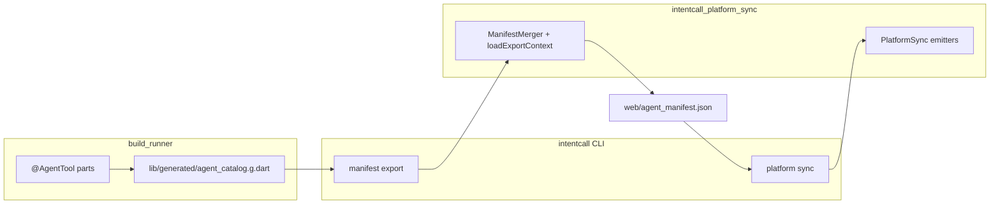
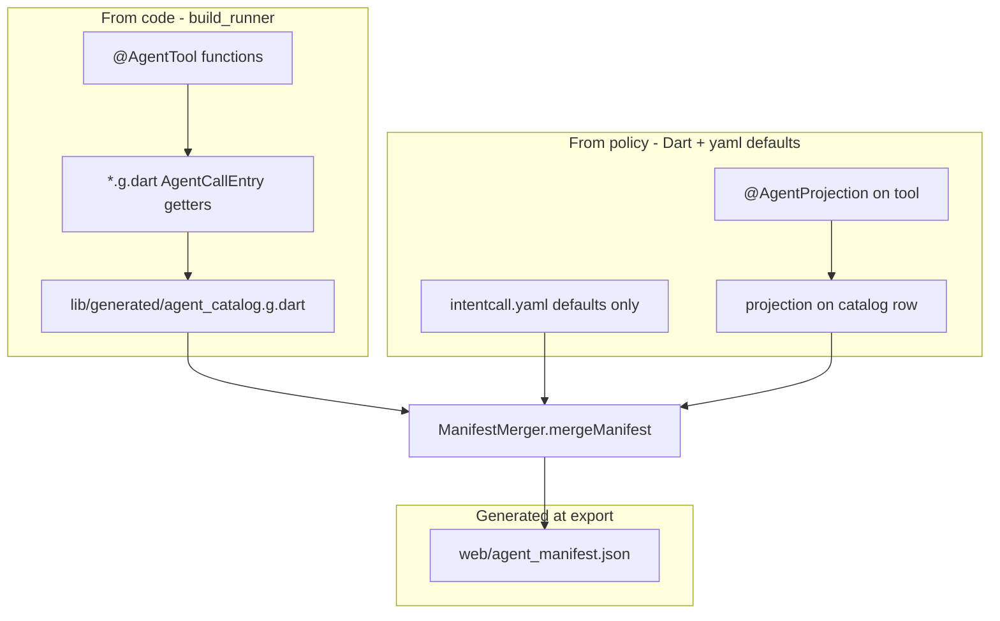
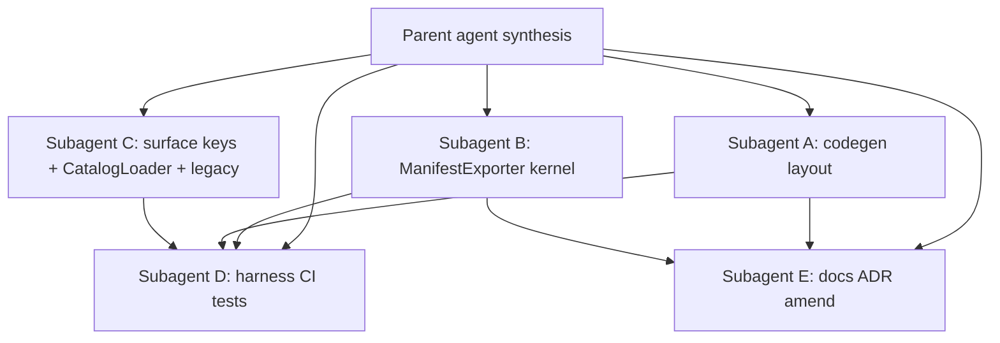

# ADR 0019 closure — full remediation plan

## Recommended architecture (DX + AX + maintainability)

**Manifest pipeline: single writer with shared kernel.**

Hooks already enforce the real spine ([`platform_hook_templates.dart`](packages/intentcall_platform_sync/lib/src/templates/platform_hook_templates.dart)):



| Choice | Why |
|--------|-----|
| **Drop `agent_manifest` builder** | Customization lives in `@AgentProjection` + `intentcall.yaml` defaults only — one merge path via CLI |
| **Shared `ManifestExportContext` in `intentcall_platform_sync`** | Both agents and humans run the same merge; codegen package has zero CLI dependency. |
| **Example mini-host + CLI fixture** | Library package stays pure; gates use deterministic fixture; `example/` remains human-runnable docs. |
| **Hybrid surface aliases + fail loud** | Ergonomic `webMcp` in yaml; unknown keys throw with valid-key hint. |

---

## Authoring model — what is generated vs hand-written

**Yes:** manifest **entries** (tools) are **generated from code**, then **enhanced** with projection settings at `intentcall manifest export` time.



### Layer responsibilities

| Artifact | Generated? | Contains |
|----------|------------|----------|
| **`@AgentTool` + `*.g.dart`** | Yes (build_runner) | Semantic truth: namespace, name, description, inputSchema, handler |
| **`lib/generated/agent_catalog.g.dart`** | Yes (build_runner) | Registry rows pointing at `*CallEntry` getters |
| **`intentcall.yaml`** | **No** — host + **global defaults only** | `host`, `protocolScheme`, `layout`, `platforms.enabled`, `defaults`. **No per-tool keys.** |
| **Per-tool projection** | **Dart only** | `@AgentProjection` on `@AgentTool`, or `EntryProjection` on `AgentRegistryCatalogEntry` for handwritten entries |
| **`web/agent_manifest.json`** | **Yes** (`intentcall manifest export`) | `merge(catalog, policy)` — full tool rows with schema + projection |
| **Platform artifacts** (`web/manifest.json`, `*.generated.js`, …) | Yes (`intentcall platform sync`) | Emitted from committed manifest |

### Merge precedence (per tool)

1. Built-in surface defaults
2. `intentcall.yaml` → `defaults`
3. **Catalog row projection** (`@AgentProjection` baked into `agent_catalog.g.dart`, or hand-written `EntryProjection` on catalog entry)

### What you never write

- Per-tool projection in any YAML file
- `.intentcall/projection.yaml`

---

## MoE decision — projection unification (code-only per tool)

**User choice:** Eliminate per-tool YAML entirely. Projection is authored in Dart only.

### Expert consensus (updated)

| Lens | Verdict |
|------|---------|
| **Architecture Skeptic** | Delete `.intentcall/projection.yaml`, `projectionOverlay`, and **`intentcall.yaml` per-tool `projection:` map** |
| **Pain Tutor** | Minimum writes: optional `defaults:` once in yaml + `@AgentProjection` colocated on each customizing `@AgentTool` |

### Authoring model (code-only per tool)

| Layer | Where | Generated? |
|-------|--------|--------------|
| Semantic truth | `@AgentTool` / `AgentCallEntry` | `.g.dart`, catalog |
| **Per-tool projection** | **`@AgentProjection` on `@AgentTool`** or **`EntryProjection` on catalog row** | Catalog carries projection into export |
| App-wide defaults | `intentcall.yaml` → `defaults` only | No |
| Host wiring | `intentcall.yaml` → `host`, `layout`, `platforms`, … | No |
| Manifest | `intentcall manifest export` | Yes |

```yaml
# intentcall.yaml — settings only, NO per-tool projection keys
host: flutter
protocolScheme: myapp
defaults:
  dispatchMode: openApp
  surfaces:
    web.webMcp: true
```

```dart
@AgentTool(namespace: 'app', name: 'cart_total', description: '...')
@AgentProjection(
  dispatchMode: 'openApp',
  surfaces: {'web.webMcp': true, 'apple.appShortcuts': false},
)
Future<AgentResult> cartTotal(...) async { ... }
```

### Handwritten `AgentCallEntry` path (no yaml escape hatch)

Extend [`AgentRegistryCatalogEntry`](packages/intentcall_platform_sync/lib/src/catalog/agent_registry_catalog.dart) with optional `EntryProjection? projection`:

```dart
AgentRegistryCatalogEntry(
  registryKey: 'app_legacy_ping',
  entry: legacyPingCallEntry,
  projection: const EntryProjection(
    dispatchMode: AgentManifestDispatchMode.queueOnly,
    surfaces: {AgentManifestSurface.webMcp: false},
  ),
)
```

Codegen catalog builder embeds `@AgentProjection` into each catalog row at generation time — export reads projection from catalog probe, not yaml.

### Merge precedence (single rule)

```
effective(row) =
  catalog[row].projection        # from @AgentProjection or hand-written catalog
  ?? intentcall.yaml defaults
  ?? built-in defaultSurfaceInclude()
```

### Delete entirely

- `.intentcall/projection.yaml` and `.intentcall/` convention for projection
- `projectionOverlay` config key
- `loadOverlayFile` for projection (or keep only for one-release migration with deprecation warning)
- Per-tool keys in `intentcall.yaml`
- `scanProjectionYaml` in catalog_loader

### Workstream B additions

1. Add `EntryProjection? projection` to `AgentRegistryCatalogEntry`
2. `AgentCatalogGenerator` — read `@AgentProjection` and emit projection in catalog rows (or companion `agent_projection.g.dart` probed alongside catalog)
3. `CatalogLoader` probe exports `projection` per row
4. `ManifestExporter` / `mergeManifest` — `overlayFor` reads from catalog row projection first, then yaml defaults
5. Collision: if `@AgentProjection` missing and no catalog projection, use defaults only (not an error)

### ADR 0019 amendment text

> Projection policy: `@AgentProjection` on annotated tools, or `EntryProjection` on handwritten catalog rows. Global defaults in `intentcall.yaml` `defaults` only. **No per-tool YAML.**

---

## Workstream A — `intentcall_codegen` lib/example separation

**Problem (investigated):** Demo `@AgentTool` in [`example/demo_ping_tool.dart`](packages/intentcall_codegen/example/demo_ping_tool.dart) feeds committed [`lib/generated/agent_catalog.g.dart`](packages/intentcall_codegen/lib/generated/agent_catalog.g.dart) via `import '../../example/...'` — published `lib/` depends on non-library code. Root [`intentcall.yaml`](packages/intentcall_codegen/intentcall.yaml) treats the library as a host.

**Target layout:**

```
packages/intentcall_codegen/          # library only
  lib/src/                            # annotations + generators (no @AgentTool)
  lib/builder.dart
  build.yaml                          # agent_tool + agent_catalog only (remove agent_manifest)
  test/fixtures/demo_ping_tool.dart   # sole unit-test source (1 tool)

packages/intentcall_codegen/example/  # runnable mini-host
  pubspec.yaml
  intentcall.yaml
  lib/tools/demo_ping_tool.dart
  lib/generated/agent_catalog.g.dart
  web/agent_manifest.json
  web/manifest.json                   # base for platform sync --check
  build.yaml                          # generate_for: lib/** only (no example/** scan in parent)

packages/intentcall_cli/test/fixtures/codegen_dart_project/  # gate fixture
  pubspec.yaml, intentcall.yaml
  lib/tools/demo_ping_tool.dart
  lib/generated/agent_catalog.g.dart  # committed
  web/agent_manifest.json, web/manifest.json, web/*.generated.js
```

**Generator default change** ([`agent_catalog_generator.dart`](packages/intentcall_codegen/lib/src/generators/agent_catalog_generator.dart), [`agent_manifest_generator.dart`](packages/intentcall_codegen/lib/src/generators/agent_manifest_generator.dart) if kept temporarily):

- Default `_toolSources` → **`lib/**.dart` only**
- Opt-in `example/**` via `build.yaml` `builder_options` for demo hosts only
- Remove root-level committed `lib/generated/`, `web/`, `intentcall.yaml` from library package

**Subagent A scope:** layout migration, update [`test/agent_tool_generator_test.dart`](packages/intentcall_codegen/test/agent_tool_generator_test.dart) to use `test/fixtures/`, README, delete duplicate `example/demo_ping_tool.dart` at old path after move.

---

## Workstream B — Unified manifest export kernel

**Problem:** [`AgentManifestAssetGenerator`](packages/intentcall_codegen/lib/src/generators/agent_manifest_generator.dart) ignores `intentcall.yaml`; CLI [`_ManifestExportCommand`](packages/intentcall_cli/lib/src/command_runner.dart) ignores `@AgentProjection`; overlay discovery inconsistent.

**Implementation:**

1. Add to [`manifest_merger.dart`](packages/intentcall_platform_sync/lib/src/projection/manifest_merger.dart):
   - `loadFullProjectionPolicy(projectRoot, {annotationOverlays})` — yaml `defaults` + inline `projection:` map + annotation overlays with **collision detection** (no separate overlay file)
   - `readPlatformLabel(projectRoot)` — `jaspr` → `web`, else `unified`
   - `readManifestRelativePath(projectRoot)` — `layout.manifest` default `web/agent_manifest.json`
   - `loadExportContext(projectRoot, {annotationOverlays})` → bundles policy + protocol + platform + path

2. Add **`ManifestExporter`** (new file under `intentcall_platform_sync/lib/src/projection/`):
   - `Future<AgentManifest> buildManifest({projectRoot, catalog})` — uses `CatalogLoader` pattern without CLI dep: accept catalog list as param
   - `Future<void> exportToFile({projectRoot, catalog, checkOnly})` — encode + write or compare

3. Refactor CLI `_ManifestExportCommand` to call `ManifestExporter`; delete `_platformLabel` duplicate.

4. **Remove `agent_manifest` builder** from [`build.yaml`](packages/intentcall_codegen/build.yaml) and delete [`agent_manifest_generator.dart`](packages/intentcall_codegen/lib/src/generators/agent_manifest_generator.dart) after parity tests pass.

5. **ADR 0019 amendment** ([`docs/decisions/0019-framework-neutral-intentcall-cli.md`](docs/decisions/0019-framework-neutral-intentcall-cli.md)): Gate 1 = `build_runner` (catalog) + `intentcall manifest export --check` (manifest); catalog builder only in codegen package.

**Subagent B scope:** platform_sync API + CLI wiring + tests in [`manifest_merger_test.dart`](packages/intentcall_platform_sync/test/manifest_merger_test.dart).

---

## Workstream C — Surface keys, CatalogLoader, legacy cleanup

### C1 — Surface alias resolution (hybrid)

In [`lookupAgentManifestSurface`](packages/intentcall_platform_sync/lib/src/agent_manifest.dart):

- Match `manifestKey` (`web.webMcp`) **or** enum `name` (`webMcp`)
- In [`ProjectionPolicy.fromYamlMap`](packages/intentcall_platform_sync/lib/src/projection/projection_policy.dart): collect unknown keys → `FormatException` listing valid keys
- Update fixture [`flutter_project/intentcall.yaml`](packages/intentcall_cli/test/fixtures/flutter_project/intentcall.yaml) to dotted keys **or** prove aliases work with test asserting `webMcp: false` actually opts out

### C2 — CatalogLoader fail-loud

In [`catalog_loader.dart`](packages/intentcall_cli/lib/src/catalog/catalog_loader.dart):

- Remove `_loadFromProjectionAndManifest` circular fallback
- If `lib/generated/agent_catalog.g.dart` missing or probe fails → clear error: *run `dart run build_runner build`*
- Add committed `agent_catalog.g.dart` to CLI fixtures (minimal 1-tool stub matching manifest)

### C3 — Legacy deletion

| Delete / deprecate | Condition |
|--------------------|-----------|
| [`intentcall_platform_sync/lib/src/agent_manifest_generator.dart`](packages/intentcall_platform_sync/lib/src/agent_manifest_generator.dart) `generateWebAgentManifest` | Migrate [`web_emitters_test.dart`](packages/intentcall_platform_sync/test/web_emitters_test.dart) line ~309 to `ManifestMerger` |
| Stale `intentcall_platform/lib/src/{emitters,sync,...}` if still on disk | Confirm re-export-only; finish deletion |
| Apple/Android `agent_manifest_generator.dart` | Deprecate exports; add ADR note if external consumers unknown |

**Subagent C scope:** surface + CatalogLoader + legacy tests; no hook changes.

---

## Workstream D — Harness, tests, CI (three gates)

### D1 — New just/steward recipes

[`justfile`](justfile):

```just
manifest-export-check:
    cd packages/intentcall_codegen/example && dart run build_runner build
    dart run intentcall_cli:intentcall manifest export --check --project-dir packages/intentcall_codegen/example
    dart run intentcall_cli:intentcall manifest export --check --project-dir packages/intentcall_cli/test/fixtures/codegen_dart_project

adr-gates:
    just manifest-export-check
    just manifest-parity
    just platform-sync-check
```

[`steward.yaml`](steward.yaml): add `intentcall.manifest-export-check`; extend `probes.quick.actions`.

[`steward/scenarios/intentcall.adapter-contract.yaml`](steward/scenarios/intentcall.adapter-contract.yaml): add `manifest-export-check`, `manifest-parity`, `platform-sync-check` to `required_actions`.

### D2 — Strengthen tests

| File | Fix |
|------|-----|
| [`command_runner_test.dart`](packages/intentcall_cli/test/command_runner_test.dart) | Remove `_normalizeManifest` / `_ensureSyncedWebArtifacts` from `setUpAll`; commit correct fixture artifacts |
| [`manifest_registry_parity_test.dart`](packages/intentcall_cli/test/manifest_registry_parity_test.dart) | Bidirectional catalog ↔ manifest qualifiedName parity on `codegen_dart_project`; load catalog via `CatalogLoader` probe |
| New `manifest_export_parity_test.dart` | `build_runner` + `export --check` on example mini-host without rewriting files |

### D3 — CI

[`.github/workflows/ci.yml`](.github/workflows/ci.yml):

- Ensure `intentcall_platform_sync` + `intentcall_cli` in test step (or `just test`)
- Add `just adr-gates` job step after `dart pub get`

### D4 — Fix `intentcall.validate` blocker

Investigate `pubspec.yaml not found for package: intentcall_schema` (steward probe failure) — likely workspace path resolution in [`tool/intentcall`](tool/intentcall); fix so `steward probe --profile quick` passes.

**Subagent D scope:** justfile, steward, CI, test fixes, validate fix.

---

## Workstream E — Docs and follow-ups (non-blocking)

- Update [`DX_FAQ.mdx`](docs/DX_FAQ.mdx), [`packages/intentcall_codegen/README.md`](packages/intentcall_codegen/README.md) with example mini-host workflow
- Document mcp_flutter delegation as **open follow-up** ([ADR §mcp_flutter](docs/decisions/0019-framework-neutral-intentcall-cli.md)); optional tracking issue
- Hook templates: consider `dart run intentcall_cli:intentcall` instead of bare `intentcall` on PATH (separate small PR)

---

## Subagent dispatch map



| Subagent | Owns | Depends on |
|----------|------|------------|
| **A** | example mini-host, CLI fixture scaffold, generator `lib/**` default | — |
| **B** | `ManifestExporter`, `loadExportContext`, remove manifest builder | — |
| **C** | surface aliases, CatalogLoader, legacy generator removal | B partial (overlay API) |
| **D** | just/steward/CI, parity tests, validate fix | A + B + C |
| **E** | ADR 0019 amendment, README/DX_FAQ | A + B |

**Merge order:** A + B + C in parallel → D integrates → E polishes → parent runs `just adr-gates` + `just test` + `steward probe --profile quick`.

---

## Success criteria (claim completion)

| Gate | Proof command |
|------|---------------|
| Gate 1 | `just manifest-export-check` passes on example + CLI fixture |
| Gate 2 | `just platform-sync-check` passes (web); codegen fixture has base `web/manifest.json` |
| Gate 3 | Parity test: catalog qualifiedNames == manifest qualifiedNames (bidirectional) |
| CI | `.github/workflows/ci.yml` runs `just adr-gates` |
| Library purity | `intentcall_codegen` root has no `lib/generated/`, no `web/`, no `intentcall.yaml` |
| Steward | `steward probe --profile quick` → passed |

---

## Risks and mitigations

| Risk | Mitigation |
|------|------------|
| ADR says two builders | Amend §Registry-backed manifest to catalog builder + CLI export |
| Fixture maintenance burden | Minimal 1-tool `codegen_dart_project`; example hosts 3 tools for richer docs |
| mcp_flutter not delegated | Document; hooks work with `dart run intentcall_cli:intentcall` |
| Breaking apps using manifest builder output | Builder removal only after export parity tests green |
