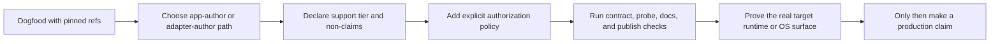

# Pre-release notice (all intentcall packages)

**Status:** Current pre-release train — contract-tested, not production-ready without app/runtime proof.

- APIs are **highly experimental** and may change without a major semver bump.
- Breaking changes can land in any pre-1.0 train patch while the design stabilizes.
- Standalone repo at [github.com/Arenukvern/intentcall](https://github.com/Arenukvern/intentcall) (sibling to `mcp_flutter` locally).
- Prefer **path** or **pinned git refs** for dogfood; use pub.dev only after explicit release notes.

**Flutter MCP Toolkit** (`mcp_toolkit`) remains the supported product surface for app authors. IntentCall is the underlying platform extracted for multi-adapter work (MCP, WebMCP, native).

Use with caution.
