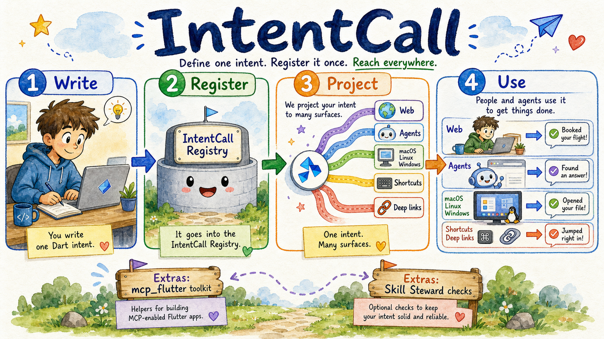

<div align="center">

# IntentCall

_Register intents. Call them everywhere._

[](https://skills.sh/arenukvern/intentcall)
[](https://github.com/Arenukvern/intentcall/actions/workflows/ci.yml)
[](https://github.com/Arenukvern/intentcall/actions/workflows/pub_publish.yml)
[](https://github.com/Arenukvern/intentcall/actions/workflows/release-please.yml)
[](https://docs.page/Arenukvern/intentcall)
[](https://opensource.org/licenses/MIT)
[](#contributors-)
[](https://github.com/Arenukvern/skill_steward)

</div>

> **Pre-release train** — Contract-tested pre-1.0 platform infrastructure. APIs may change without notice. **Not for production claims without app/runtime proof.** See [PRE_RELEASE.md](PRE_RELEASE.md).

Transport-agnostic agent intent platform for Dart/Flutter: define intent truth once in `AgentRegistry`, then project it into the strongest available surface: MCP/WebMCP, native action metadata where supported, assistant/shortcut fulfillment, and canonical deep-link fallback where native support is incomplete.



Conceptual map: write one Dart intent, register it once, project it to useful surfaces, then people and agents use it.

**Start here:** [How it works](docs/start_here/how_it_works.mdx) · [Choose your path](docs/start_here/choose_your_path.mdx) · [Platform support](docs/start_here/platform_support.mdx) · [Roadmap](docs/start_here/roadmap.mdx)

**Charter:** [docs/NORTH_STAR.mdx](docs/NORTH_STAR.mdx) · **Agent map:** [AGENTS.md](AGENTS.md) · **Docs site:** [docs.page/Arenukvern/intentcall](https://docs.page/Arenukvern/intentcall)<br>
**Why / how:** [docs/DESIGN_FAQ.mdx](docs/DESIGN_FAQ.mdx) · [docs/DX_FAQ.mdx](docs/DX_FAQ.mdx) · [Decisions](docs/decisions/) · [CONTRIBUTING.md](CONTRIBUTING.md)<br>
**Contribute:** [guide](CONTRIBUTING.md) · [contributors](docs/contributing/contributors.mdx) · [security](SECURITY.md)

GitHub: [Arenukvern/intentcall](https://github.com/Arenukvern/intentcall)

## Ecosystem

| Repo | Role |
|---|---|
| **IntentCall** (this repo) | Platform layer — registry + adapters |
| **[mcp_flutter](https://github.com/Arenukvern/mcp_flutter)** | Early consumer and product harness — `mcp_toolkit`, `flutter-mcp-toolkit` CLI |
| **[Skill Steward](https://github.com/Arenukvern/skill_steward)** | Meta-layer — agent skills governance |

## Published Packages

| Package | Pub.dev | Role |
|---------|---------|------|
| `intentcall_schema` | [](https://pub.dev/packages/intentcall_schema) [](https://pub.dev/packages/intentcall_schema/score) | Wire types, validation, `AgentResult` |
| `intentcall_core` | [](https://pub.dev/packages/intentcall_core) [](https://pub.dev/packages/intentcall_core/score) | Registry, runtime, `AgentCallEntry`, and neutral tool/resource registration vocabulary |
| `intentcall_session` | [](https://pub.dev/packages/intentcall_session) [](https://pub.dev/packages/intentcall_session/score) | Runtime session lifecycle, persisted session state, snapshots, and registry execution inside a session |
| `intentcall_mcp` | [](https://pub.dev/packages/intentcall_mcp) [](https://pub.dev/packages/intentcall_mcp/score) | MCP publish adapter and MCP mapping (`dart_mcp`) |
| `intentcall_webmcp` | [](https://pub.dev/packages/intentcall_webmcp) [](https://pub.dev/packages/intentcall_webmcp/score) | WebMCP hot-sync adapter |
| `intentcall_platform_sync` | [](https://pub.dev/packages/intentcall_platform_sync) | Dart-only manifest, emitters, and `PlatformSync` |
| `intentcall_hooks` | [](https://pub.dev/packages/intentcall_hooks) | Dart build hooks for manifest export and platform sync |
| `intentcall_bridge` | [](https://pub.dev/packages/intentcall_bridge) | Pigeon IDL and generated Dart bindings for the platform bridge |
| `intentcall_cli` | [](https://pub.dev/packages/intentcall_cli) | Framework-neutral CLI: manifest export, platform sync, MCP serve |
| `intentcall_platform` | [](https://pub.dev/packages/intentcall_platform) [](https://pub.dev/packages/intentcall_platform/score) | Flutter runtime host / federated umbrella (re-exports `intentcall_platform_sync`) |
| `intentcall_codegen` | [](https://pub.dev/packages/intentcall_codegen) [](https://pub.dev/packages/intentcall_codegen/score) | Optional `@AgentTool` codegen |
| `intentcall_testing` | [](https://pub.dev/packages/intentcall_testing) [](https://pub.dev/packages/intentcall_testing/score) | Contract / invoke test helpers |

`intentcall_gemma` is example-only and intentionally unpublished. `intentcall_cli`
is the workspace maintainer tool and is not part of the hosted package train.

Platform support is tiered during the current pre-1.0 train: current code covers contract-tested MCP adapters, Dart-first WebMCP emitter/bootstrap helpers, Apple App Intents dispatch wrappers plus explicit main-app Swift `nativeInline` handlers, typed primitive App Intents return generation for Apple inline runtimes, an experimental Apple `dartExtensionInline` scaffold, Android shortcut/deep-link artifacts, Windows protocol activation artifacts, and Linux `x-scheme-handler` artifacts. L3 adds an additive actions/entities/indexing direction: Dart owns snapshots and behavior, while Apple is the first projection that can read a durable native cache when Flutter is cold. Generated schemas, artifacts, native cache rows, and storage helpers are not live Spotlight, Siri, Shortcuts, donation, indexing, or product proof. Android AppFunctions, richer Android App Actions capability generation, Windows App Actions / Agent Launchers, and AAIF ecosystem alignment are roadmap targets unless documented otherwise. See [Platform support](docs/start_here/platform_support.mdx) for evidence levels and non-claims.

## Agent Skills

We provide custom agent skills to assist in developing with and extending IntentCall:

| Skill | Description | Install command |
|---|---|---|
| [register-intents](skills/register-intents/SKILL.md) | Guide to manual and codegen intent registration. | `npx skills add Arenukvern/intentcall --skill register-intents` |
| [write-adapter](skills/write-adapter/SKILL.md) | Guide to implementing custom platform/transport adapters. | `npx skills add Arenukvern/intentcall --skill write-adapter` |

Repository management is guided by [Skill Steward](https://github.com/Arenukvern/skill_steward) meta-skills (installed in `.agents/skills/`).

## Development

Human local setup:

```bash
dart pub get
just test
just analyze
just publish-dry-run   # pub.dev dry-run (all packages)
```

Agent/operator first run:

```bash
steward doctor --json
steward actions list --json
steward action inspect intentcall.validate --json
steward action inspect intentcall.adapter-contract-test --json
steward probe --json --profile quick
steward benchmark --scenario intentcall.adapter-contract --json
```

Release maintainers use Release Please. Merging the release PR creates package tags; tag-triggered GitHub Actions publishes through pub.dev automated publishing.

See [docs/DX_FAQ.mdx](docs/DX_FAQ.mdx) for detailed workflows.

## Development Support

| Need | Start here |
|---|---|
| Contribute code or docs | [CONTRIBUTING.md](CONTRIBUTING.md) |
| Add or credit contributors | [Contributors guide](docs/contributing/contributors.mdx) · [`.all-contributorsrc`](.all-contributorsrc) |
| Report vulnerabilities | [SECURITY.md](SECURITY.md) |
| Validate local changes | `steward probe --json --profile quick` · `steward benchmark --scenario intentcall.adapter-contract --json` |
| Maintain releases | [PUBLISHING.md](PUBLISHING.md) · [Release Please workflow](.github/workflows/release-please.yml) |
| Build with the Flutter harness consumer | [mcp_flutter](https://github.com/Arenukvern/mcp_flutter) |

## Git history

This repository starts with a **fresh history** (2026-05-28). IntentCall originated during early `mcp_flutter` proof work, and earlier package history remains in the `mcp_flutter` git log. The reusable registry, adapter, session, and platform-projection contracts are now owned here; `mcp_flutter` remains an early consumer and proof harness.

## Flutter App Harness

Flutter app authors who want the packaged product harness should start with **`mcp_toolkit`** and the `flutter-mcp-toolkit` CLI. IntentCall packages are the reusable platform layer used by that harness and by other adapters, CLIs, servers, and platform bridges.

## Contributing

See [CONTRIBUTING.md](CONTRIBUTING.md). All PRs must pass `just test && just analyze && just publish-dry-run`.

## Contributors ✨

Thanks to everyone helping shape IntentCall.

This roster is maintained with [all-contributors](https://allcontributors.org/).
To add someone, update [`.all-contributorsrc`](.all-contributorsrc) and
regenerate the README table, or use the all-contributors bot/CLI from a PR.
More detail: [docs/contributing/contributors.mdx](docs/contributing/contributors.mdx).

<!-- https://allcontributors.org/docs/en/bot/usage -->

<!-- ALL-CONTRIBUTORS-LIST:START - Do not remove or modify this section -->
<!-- prettier-ignore-start -->
<!-- markdownlint-disable -->
<table>
  <tbody>
    <tr>
      <td align="center" valign="top" width="14.28%"><a href="https://github.com/Arenukvern"><br /><sub><b>Anton Malofeev</b></sub></a><br /><a href="#code-Arenukvern" title="Code">💻</a> <a href="#doc-Arenukvern" title="Documentation">📖</a> <a href="#maintenance-Arenukvern" title="Maintenance">🚧</a> <a href="#infra-Arenukvern" title="Infrastructure (Hosting, Build-Tools, etc)">🚇</a></td>
    </tr>
  </tbody>
</table>

<!-- markdownlint-restore -->
<!-- prettier-ignore-end -->

<!-- ALL-CONTRIBUTORS-LIST:END -->

## Publishing

See [PUBLISHING.md](PUBLISHING.md). The normal path is Release Please merge -> tag-triggered GitHub Actions publish; manual publish commands are recovery-only.
