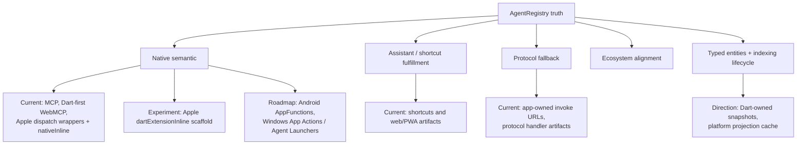

# IntentCall — North Star

**Tagline:** *Register intents. Call them everywhere.*

IntentCall is a **transport-agnostic agent intent platform** for Dart/Flutter. It provides a central registry (`AgentRegistry`), a typed invocation model (`AgentCallEntry` / `RegisteredAgentIntent`), and adapters that publish intents to MCP, WebMCP, and platform artifacts.

The north star is **define intent truth once, then project it into the strongest available platform surface**. Dart remains the preferred home for application business logic, action handlers, and domain snapshots. Platform projections should publish native metadata, collect supported parameters, wake or route into the app when needed, and dispatch an invocation envelope back to the Dart `AgentRegistry` unless a platform has separately proven native execution support.

Today, the repository implements the registry/runtime foundation, contract-tested MCP/WebMCP adapters, Dart-first invocation primitives, and platform artifact emitters for `web`, `android`, `ios`, `macos`, `linux`, and `windows`. L3 extends that direction with additive actions, typed app entities, and indexing lifecycle docs: Dart owns the snapshots and source-of-truth, while platform code may keep a durable native projection cache for query/indexing paths that run while Flutter is cold. Artifact emitters, generated schemas, native caches, and sync helpers are not the same as live OS/runtime proof. `agent_manifest.json` is a **generated projection artifact** refreshed by `build_runner` and `intentcall manifest export --check`; use `intentcall_cli` for framework-neutral platform sync (Flutter, Jaspr, and other Dart hosts).

IntentCall is also the canonical home for IntentCall philosophy, platform projection semantics, agentic experience (AX), developer experience (DX), and IntentPack direction. Consumer repositories such as `mcp_flutter` prove and document integration, but do not define IntentCall's architecture or platform contract.

---

## Platform support model

| Tier | Meaning | Current / target surfaces |
|---|---|---|
| Native semantic | Platform-recognized tool/action models that preserve intent metadata and structured invocation semantics. | Current: MCP adapter, Dart-first WebMCP adapter, Apple App Intents dispatch wrappers plus explicit main-app Swift `nativeInline`. Target: Android AppFunctions, Windows App Actions / Agent Launchers. |
| Assistant / shortcut fulfillment | Assistant, shortcut, or launcher declarations that can route user-visible actions into app intent handling. | Current: Apple shortcuts artifacts, Android shortcut/deep-link artifacts, web/PWA artifacts. Target: richer Android App Actions capability generation. |
| Protocol fallback | Stable URI/protocol invocation when no native semantic surface is available or implemented yet. | Current: app-owned `<scheme>://invoke/...`, web protocol handlers, Windows protocol activation artifacts, Linux `x-scheme-handler/<scheme>` artifacts. |
| Typed entities and indexing lifecycle | App-owned entity snapshots and additive action/entity metadata projected into platform query and indexing systems. Dart remains the source-of-truth; native caches serve cold-start query paths. | First projection: Apple App Intents entity/query and indexing/donation scaffolds. Later: platform-specific equivalents where real APIs and proof exist. |
| Ecosystem alignment | Compatibility with agent ecosystem conventions without claiming an OS-level integration contract. | Current: MCP conventions. Target: AAIF-hosted ecosystem alignment where relevant. |

Support tiers are explicit on purpose. Apple App Intents are currently parameterized native wrappers that can enqueue an invocation envelope and open/wake the app for Dart execution, or call app-owned Swift code through explicit `nativeInline`; Apple is also the first typed-entity/indexing projection. `dartExtensionInline` is scaffold-only until a fixture extension proves live runtime behavior. Linux is currently protocol-fallback first. Windows currently has protocol activation artifacts, while native Windows App Actions / Agent Launcher support remains roadmap. Android currently has shortcut/deep-link artifacts, while AppFunctions and fuller App Actions capability generation remain roadmap.

---

## What this repo owns

| In scope | Out of scope |
|---|---|
| `intentcall_schema` — wire types, validation, `AgentResult` | Product harness for app authors → **mcp_flutter / mcp_toolkit** |
| `intentcall_core` — registry, runtime, call entries, neutral tool/resource registration vocabulary | Agent skill meta-layer → **Skill Steward** |
| `intentcall_session` — runtime session lifecycle, persistence, snapshots | Runtime discovery and inspection inside concrete apps → **mcp_flutter / mcp_toolkit** |
| `intentcall_mcp` — MCP publish adapter and MCP mapping only | Embedding / RAG / LLM backends |
| `intentcall_webmcp` — WebMCP hot-sync adapter | UI rendering, visual harness reconstruction |
| `intentcall_platform` — native/web emitters + Flutter plugin | Any production app serving end users |
| `intentcall_codegen` — optional `@AgentTool` code generation | |
| `intentcall_testing` — contract / invoke test helpers | |
| `intentcall_gemma` / `intentcall_apple` / `intentcall_android` — surface adapters | |

**Do not own:** harness tooling (CLI, inspector UI), skill governance, LLM prompt engineering, or any product that wraps IntentCall for end users.

---

## Success criteria

1. A Flutter app can register intent truth once and expose it over MCP, WebMCP, and platform artifacts without per-transport boilerplate where support exists.
2. The `intentcall_schema` wire contract is stable enough that adapters can evolve independently without breaking consumers.
3. Platform support is documented by tier: native semantic, assistant / shortcut fulfillment, protocol fallback, or roadmap.
4. `<app-scheme>://invoke/...` remains the canonical fallback invocation shape across platforms that lack implemented native semantic support; each app owns its scheme declaration, and fallback routes are untrusted unless a generated wrapper or app allowlist marks the source as trusted.
5. Typed entity and indexing projections can be refreshed from Dart-owned snapshots, with native query code reading durable projection caches rather than assuming Flutter is warm.
6. `just test && just analyze && just publish-dry-run` stays green on every PR.
7. A new adapter author can read `intentcall_core` + one existing adapter and ship a working adapter in a single session.

---

## Ecosystem

| Repo | Role |
|---|---|
| **IntentCall** (this repo) | Platform layer — registry + adapters |
| **[mcp_flutter](https://github.com/Arenukvern/mcp_flutter)** | Early consumer and product harness — `mcp_toolkit`, `flutter-mcp-toolkit` CLI |
| **[Skill Steward](https://github.com/Arenukvern/skill_steward)** | Meta-layer — agent skills governance |

---

## AX and DX north star

**Agentic experience (AX)** means an agent can discover, inspect, invoke, diagnose, and repair an app's intent surface without bespoke repository knowledge. The intended loop is: discover available intent surfaces, inspect intent schemas and examples, invoke through the best available transport, explain failures by capability/schema/permission/platform/runtime category, then suggest the next repair action.

**Developer experience (DX)** means app and package authors define intent semantics once, keep handwritten entries first-class, and use optional generation or composition to project that surface into MCP, WebMCP, Flutter runtime registries, CLI hosts, deep links, and future native-platform artifacts with minimal boilerplate.

The proposed public direction is **IntentPack**: a portable unit of agent surface area containing a stable pack id, name, description, entries/intents, schemas, examples, side-effect metadata, confirmation and safety policy, platform projection hints, runtime adapter hints, and compatibility metadata. IntentPack is direction, not a shipped stable API contract yet; current shipped authoring remains `AgentRegistry`, `AgentCallEntry`, and `RegisteredAgentIntent`.

---

## Ethical principles

IntentCall is **pre-release platform infrastructure**, not a consumer product. These principles govern how it is built:

1. **Legibility over magic.** APIs must be deterministic and include remediation paths in errors. Do not paraphrase code logic in docs — link to the implementation.
2. **Reversibility.** Installers and codegen must never leave undocumented side-effects. Uninstall must be as clean as install.
3. **No bloat.** Refuse feature requests that introduce convenience over clarity. Keep the dependency footprint minimal per package.
4. **Behavior-as-truth.** Wire contracts (`intentcall_schema`) define the protocol. Adapters implement; they do not redefine.
5. **Artisan credit.** Human authorship is primary. AI is a collaborator; all significant decisions are recorded in ADRs with date and decision-maker.

---

## Pre-release status

All packages are on the **pre-1.0 train** — experimental. APIs may change without a major semver bump. See [PRE_RELEASE.md](https://github.com/Arenukvern/intentcall/blob/main/PRE_RELEASE.md).

## Key docs

- [AGENTS.md](https://github.com/Arenukvern/intentcall/blob/main/AGENTS.md) — agent map and navigation pointers
- [How it works](/start_here/how_it_works) — registry, adapters, invocation flow, and neighboring systems
- [Choose your path](/start_here/choose_your_path) — package choices by task
- [Platform support](/start_here/platform_support) — evidence levels, trust model, and roadmap non-claims
- [Roadmap](/start_here/roadmap) — current shipped model and direction
- [DESIGN_FAQ.mdx](/DESIGN_FAQ) — why IntentCall is built this way
- [DX_FAQ.mdx](/DX_FAQ) — how to use and extend IntentCall
- [docs/decisions/](/decisions/README) — architecture decision records
- [CONTRIBUTING.md](https://github.com/Arenukvern/intentcall/blob/main/CONTRIBUTING.md) — how to contribute
- [PUBLISHING.md](https://github.com/Arenukvern/intentcall/blob/main/PUBLISHING.md) — pub.dev publishing guide
