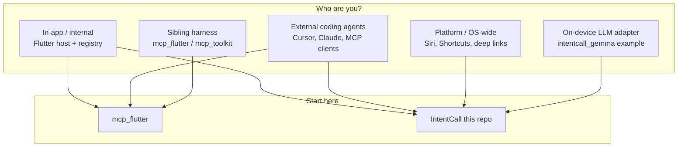
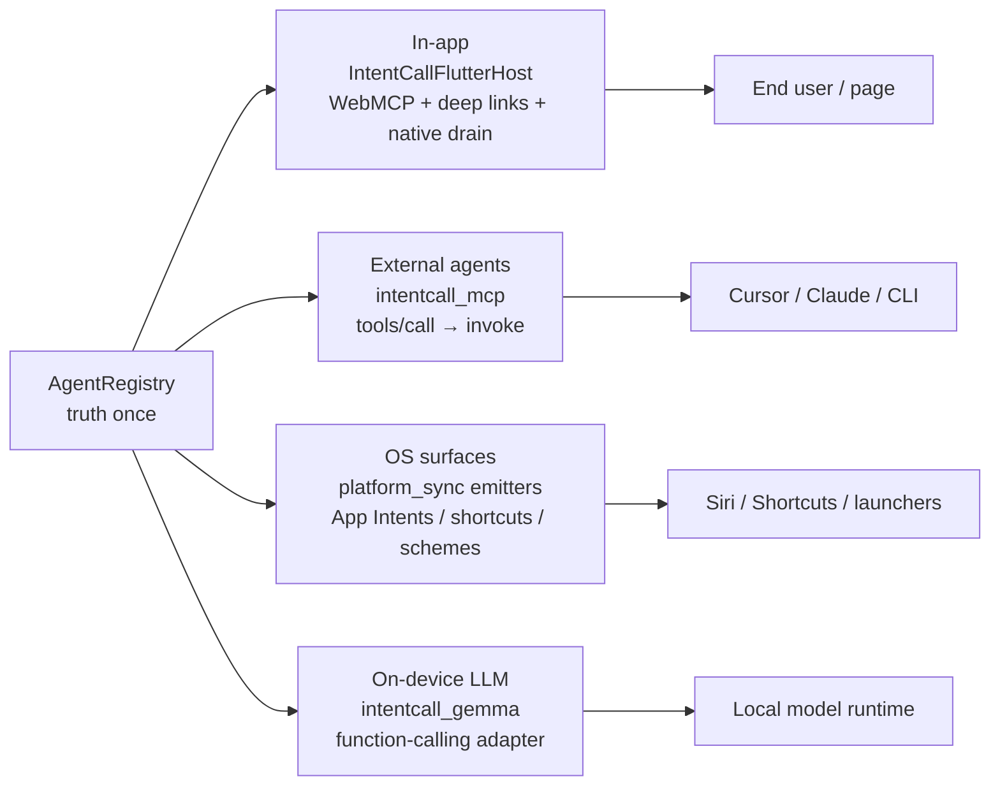
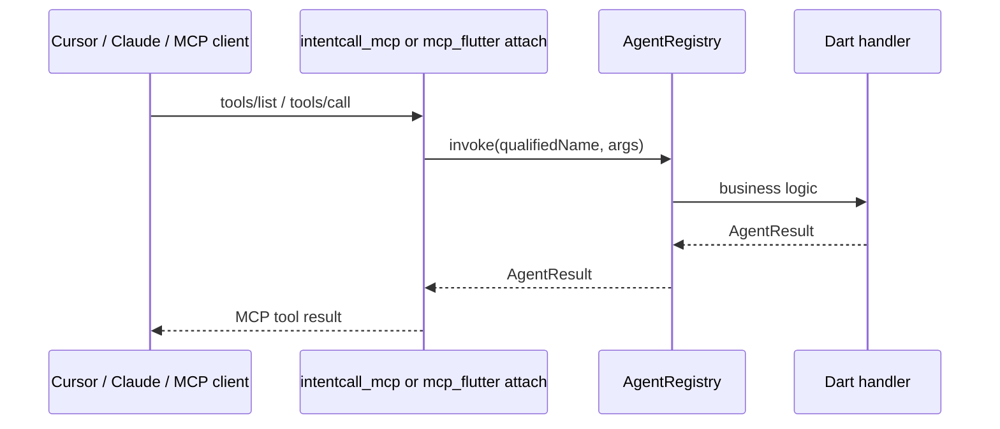
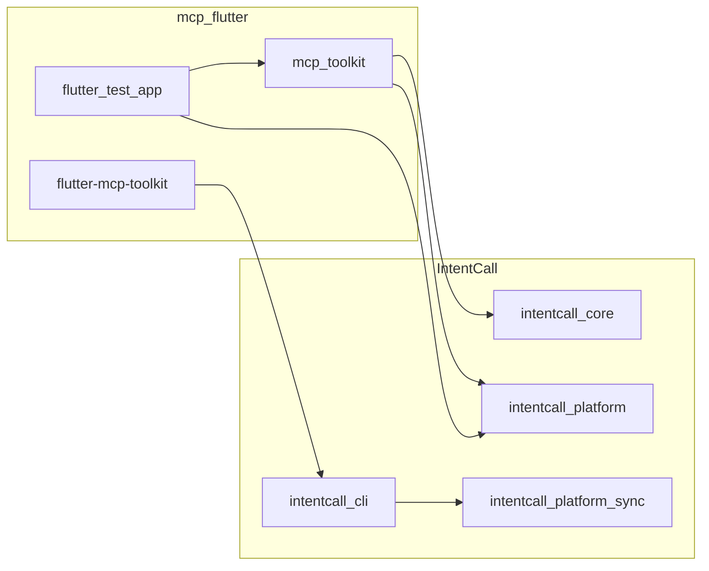

# Who is this for?

IntentCall is **platform infrastructure**: one `AgentRegistry`, many projections.
Most Flutter app authors start in [mcp_flutter](https://github.com/Arenukvern/mcp_flutter)
(the product harness), then depend on IntentCall packages for registry, MCP,
WebMCP, and OS projection. This page routes by **audience**, not by package name.



## Audience map

| You are… | Start | Key packages | Prove with | Wrong move |
|---|---|---|---|---|
| **In-app Flutter author** — register intents, bind host, drain envelopes | [mcp_flutter](https://github.com/Arenukvern/mcp_flutter) → then this page §1 | `intentcall_core`, `intentcall_platform` (umbrella), optional `intentcall_codegen` | App runs + host start; web/macOS dogfood in mcp_flutter | Depending on deleted `intentcall_apple` / `intentcall_android` |
| **External coding-agent consumer** — Cursor/Claude call your app over MCP | mcp_flutter MCP attach **or** `intentcall_mcp` | `intentcall_mcp`, `intentcall_session` | MCP contract + live client tools/call | Treating Steward repo probes as app MCP setup |
| **Platform / OS integrator** — App Intents, shortcuts, schemes | [Platform support](/start_here/platform_support) | `intentcall_platform_sync`, `intentcall_cli`, `intentcall_bridge` | `intentcall platform sync --check`; evidence labels | Claiming Siri/Spotlight from artifact tests alone |
| **Harness maintainer / app author using mcp_toolkit** | mcp_flutter README | `mcp_toolkit`, `flutter-mcp-toolkit` CLI → delegates to `intentcall_cli` | `make check-contracts`, dogfood targets | Forking platform contracts inside the harness |
| **On-device LLM / custom surface adapter author** | [Choose your path](/start_here/choose_your_path) + write-adapter skill | `intentcall_gemma` (**example-only**), `intentcall_testing` | `verifyNativeAdapterContract` + adapter-contract benchmark | Shipping Gemma as a production SDK |

## One registry, four consumer lanes



Dart handlers stay the source of truth. Adapters publish metadata and route
invocations; they do not redefine business logic.

---

## 1. In-app / internal (Flutter host)

**Goal:** The running app owns the registry, binds a host, and accepts
invocations from WebMCP, deep links, and native open-app envelopes.

### Setup

1. Depend on the **umbrella only** for runtime:

```yaml
dependencies:
  intentcall_core: ^0.6.0
  intentcall_platform: ^0.6.0   # endorses platform_apple + platform_android
dev_dependencies:
  intentcall_cli: ^0.6.0
  intentcall_codegen: ^0.6.0    # optional
```

2. Add `intentcall.yaml` (required for `host: flutter` / `jaspr` — empty
   `platforms.enabled` fails `intentcall config validate`):

```yaml
host: flutter
protocolScheme: myapp
platforms:
  enabled: [android, ios, macos, web]   # subset you actually ship
```

3. Register tools once (`AgentCallEntry` / optional `@AgentTool`).
4. Bind the host at startup:

```dart
final host = IntentCallFlutterHost.bindRegistry(
  registry: registry,
  policy: const IntentCallAuthorizationPolicy(
    allowedSources: {
      IntentCallInvocationSource.webMcpDart,
      IntentCallInvocationSource.nativeGenerated,
      IntentCallInvocationSource.deepLink,
    },
  ),
  registerWebMcp: kIsWeb,
  listenForDeepLinks: !kIsWeb,
  protocolScheme: 'myapp',
);
await host.start();
```

5. One-time hooks + sync:

```bash
# via IntentCall CLI
dart run intentcall_cli:intentcall platform hooks init --host flutter
dart run intentcall_cli:intentcall config validate
dart run intentcall_cli:intentcall manifest export --check
dart run intentcall_cli:intentcall platform sync --check

# or via mcp_flutter wrapper (same spine)
dart run mcp_server_dart/bin/flutter_mcp_toolkit.dart init intentcall-platform \
  --project-dir .
dart run mcp_server_dart/bin/flutter_mcp_toolkit.dart codegen sync \
  --platform web,ios,macos --project-dir .
```

**Federated note:** apps do **not** depend on `intentcall_platform_apple` /
`intentcall_platform_android` directly unless overriding endorsed packages.
Projection stays in `intentcall_platform_sync` (pulled transitively / via CLI).

Deep checklist: [DX FAQ — Flutter in-app host](/DX_FAQ#flutter-in-app-host).

---

## 2. External coding agents (MCP clients)

**Goal:** An IDE or CLI agent discovers tools and calls `registry.invoke` through
MCP. The agent never imports IntentCall packages — it speaks MCP.



### Two happy paths

| Path | When | How |
|---|---|---|
| **A — Flutter app + mcp_flutter** | App is running; agent attaches to VM / toolkit | Use mcp_flutter MCP server + `mcp_toolkit` bootstrap; registry lives in the app |
| **B — Headless / library host** | No Flutter UI | Attach `McpPublishAdapter` (`intentcall_mcp`) to a registry; serve over your MCP transport |

**Not this lane:** Skill Steward `steward probe` / repo actions — those govern
*this repository*, they do not expose your product app to Cursor.

Prove with: `verifyNativeAdapterContract` + live client `tools/call`. See
[Choose your path — Publish MCP](/start_here/choose_your_path) and
[DX FAQ — Writing a new adapter](/DX_FAQ#writing-a-new-adapter).

---

## 3. Platform / OS-wide agents

**Goal:** OS assistants and launchers see projected metadata (App Intents,
shortcuts, protocol handlers) and route back into the app.

Read [Platform support](/start_here/platform_support) **before** claiming live
Siri/Shortcuts/Spotlight behavior. Artifact + sync proof ≠ live OS proof.

| Surface | Package / tool | Typical proof |
|---|---|---|
| Apple App Intents / Shortcuts | `intentcall_platform_sync` emitters + `intentcall_platform_apple` | `platform sync --check`; AppIntentsTesting / signed app for runtime |
| Android shortcuts / deep links | emitters + `intentcall_platform_android` | Manifest/XML drift checks |
| Web / PWA / WebMCP | emitters + `intentcall_webmcp` / host `registerWebMcp` | Emitter tests + browser verify |
| Windows / Linux protocol | emitters | Artifact `--check` only |

Subset contract: `platforms.enabled` scopes projection defaults and hook
targets. Federation scopes per-target native compile. Config does **not** remove
transitive pub deps.

---

## 4. Sibling harness — mcp_flutter

**Goal:** Product DX for Flutter authors (CLI, VM discovery, inspector, dogfood
app). IntentCall owns contracts; mcp_flutter consumes them.



### Maintainer vs external author

| Role | Dependency style | Gate |
|---|---|---|
| **mcp_flutter maintainers** (sibling dogfood) | Path deps to `../agentkit/packages/intentcall_*` | `make check-contracts`, `make dogfood-eval-static` |
| **External app authors** | Hosted `intentcall_*: ^0.6.0` from pub.dev | App tests + `intentcall platform sync --check` |

### Dogfood proof in `flutter_test_app` (sibling checkout)

Clone as siblings: `mcp_flutter` next to `agentkit` (`INTENTCALL_ROOT=../agentkit`).

| Platform | What is proven today | How |
|---|---|---|
| **Web** | Strong — WebMCP JS + host bind + verify | `make web-showcase`, `flutter-mcp-toolkit webmcp verify` |
| **macOS** | Runtime — generated Swift + host drain + validate | `make showcase`, `make macos-validate-runtime` |
| **iOS** | Scaffold + codegen drift (same Apple emitters as macOS) | Xcode hooks + `codegen sync --check`; **live** App Intents needs signed `xcodebuild test` / AppIntentsTesting |
| Android / Linux / Windows | Codegen / protocol artifacts | `codegen sync --check` |

**Claim ceiling for “migration complete”:** sibling path deps resolve the
federated umbrella; web + macOS dogfood targets pass; iOS shares Apple
projection with macOS and passes sync `--check`. That is **not** a claim of
App Store discovery or unsigned-device Siri UX.

Migration checklist for mcp_flutter:

1. Depend on `intentcall_platform` (not deleted `intentcall_apple` / `_android`).
2. Add `intentcall.yaml` with explicit `platforms.enabled` (test app should gain this).
3. `init intentcall-platform` + `codegen sync` for web,ios,macos (and others you ship).
4. Keep `IntentCallFlutterHost.bindRegistry` in app bootstrap.
5. Run `make check-contracts` and platform dogfood targets above.

Consumer guide in the harness repo:
[mcp_flutter/docs/intentcall/README.md](https://github.com/Arenukvern/mcp_flutter/blob/main/docs/intentcall/README.md).

---

## 5. Gemma and other surface adapters

**`intentcall_gemma`** is an **example-only** on-device function-calling adapter
(`publish_to: none`). Pattern: thin surface over `AgentRegistry` — same contract
as MCP, different transport.

Use it to learn adapter shape; do **not** treat it as a production LLM SDK.
Ship new surfaces with `intentcall_testing` +
`steward benchmark --scenario intentcall.adapter-contract --json`.

Skill: [write-adapter](https://github.com/Arenukvern/intentcall/tree/main/skills/write-adapter).

---

## Common mistakes

| Mistake | Fix |
|---|---|
| Artifact green ⇒ Siri/Shortcuts work | Read evidence labels on [Platform support](/start_here/platform_support) |
| Steward probe = app MCP for Cursor | Use mcp_flutter attach or `intentcall_mcp` |
| Depend on `intentcall_apple` / `_android` | Deleted; use `intentcall_platform` + `platform_sync` |
| Empty `platforms.enabled` on flutter/jaspr | `intentcall config validate` (exit 65) |
| Implement harness features in IntentCall | Keep discovery/inspector in mcp_flutter |

## Next

- Architecture → [How it works](/start_here/how_it_works)
- Packages by task → [Choose your path](/start_here/choose_your_path)
- Evidence / non-claims → [Platform support](/start_here/platform_support)
- Procedures → [DX FAQ](/DX_FAQ)
