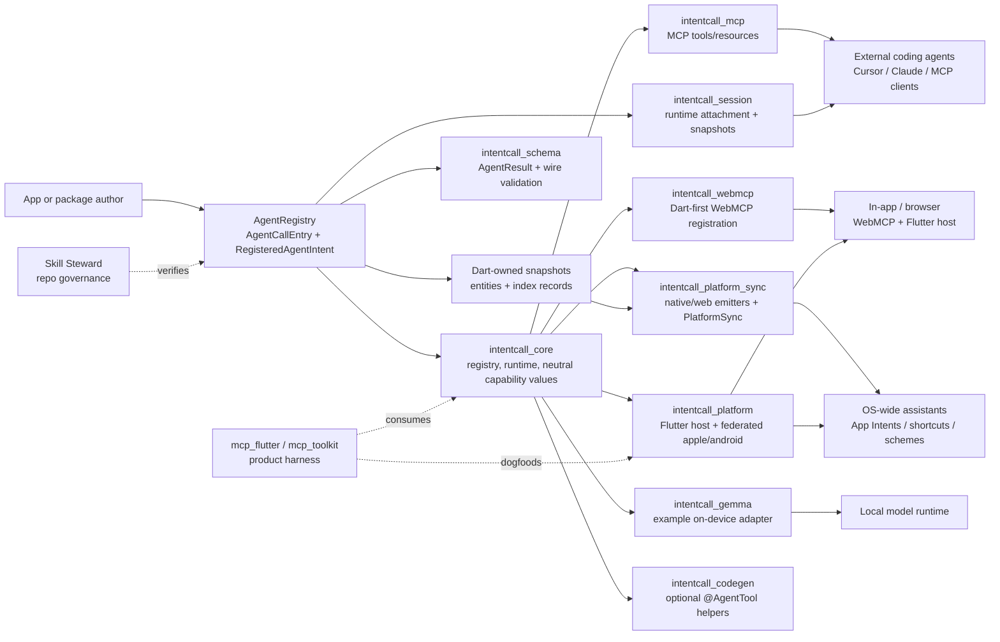
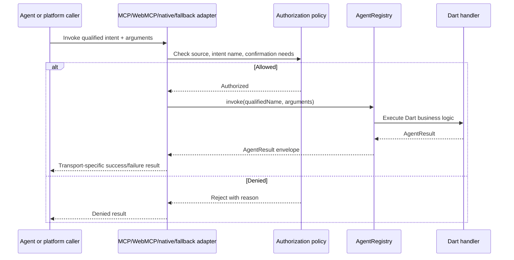

# How IntentCall Works

IntentCall gives a Dart or Flutter program one source of truth for agent-callable behavior: the `AgentRegistry`. A tool is registered once, then adapters project that registry entry into MCP, WebMCP, platform artifacts, or fallback invoke routes.

The key idea is simple: adapters publish and route calls, but Dart remains the home of application behavior.

**Not sure which lane you are in?** Start with [Who is this for?](/start_here/audiences) (in-app host, external MCP agents, OS surfaces, mcp_flutter, Gemma).



## One Minimal Intent

This is the smallest useful shape: define a tool, register it, and invoke it through the registry. Adapters use the same registry entry instead of copying the handler into another transport.

```dart
import 'package:intentcall_core/intentcall_core.dart';
import 'package:intentcall_schema/intentcall_schema.dart';

Future<void> main() async {
  final registry = InMemoryAgentRegistry();

  registry.register(
    AgentCallEntry.tool(
      namespace: 'demo',
      name: 'ping',
      description: 'Return a pong payload.',
      inputSchema: const {
        'type': 'object',
        'properties': {
          'message': {'type': 'string'}
        }
      },
      handler: (arguments) async {
        final message = arguments['message'] as String? ?? 'pong';
        return AgentResult.success(data: {'reply': message});
      },
    ).toRegistration(),
  );

  final result = await registry.invoke(
    'demo.ping',
    const {'message': 'hello'},
  );

  print(result.data);
}
```

## Invocation Flow



Native wrappers and fallback routes should collect supported parameters, authorize the source, and dispatch an invocation envelope back to Dart when Dart owns execution. Apple App Intents wrappers can launch or wake the app and dispatch to the Dart registry, or use explicit `nativeInline` to call app-owned Swift handlers in the main app target. Apple inline runtimes can generate primitive typed App Intents returns when `inlineRuntime.result` is declared. `dartExtensionInline` has an experimental scaffold and Dart runtime bridge, but still does not prove automatic extension target generation or live OS invocation.

## Actions, Entities, and Indexing

L3 keeps actions, typed entities, and indexing additive:

- Actions are still registered behavior in `AgentRegistry`.
- Typed entities come from Dart-owned snapshots of app data.
- Indexing and donation lifecycles copy those snapshots into platform
  projection caches.
- Native query/indexing code reads durable native cache data because Flutter may
  be cold.

Apple is the first concrete projection for this lane. Generated schemas,
artifacts, cache rows, and native storage helpers prove shape and synchronization
only; live Spotlight, Siri, Shortcuts, donation, indexing, and product behavior
need a signed consuming app or AppIntentsTesting proof where applicable.

## Neighboring Systems

| Surface | What it is for |
|---|---|
| IntentCall | Registry, wire contracts, adapters, platform artifact emitters, session primitives, and adapter contract tests. |
| mcp_flutter / mcp_toolkit | Product harness for Flutter app authors: CLI, runtime discovery, Flutter VM integration, inspection, and app-side bootstrap. Dogfoods IntentCall via `flutter_test_app` (web + macOS runtime; iOS sync/scaffold). |
| Skill Steward | Repository governance, declared actions, probes, benchmarks, and agent workflow discipline — **not** your product MCP for Cursor. |
| intentcall_gemma | Example-only on-device function-calling adapter (`publish_to: none`). |

Audience routing: [Who is this for?](/start_here/audiences). For implementation routes, continue to [Choose Your Path](/start_here/choose_your_path).
