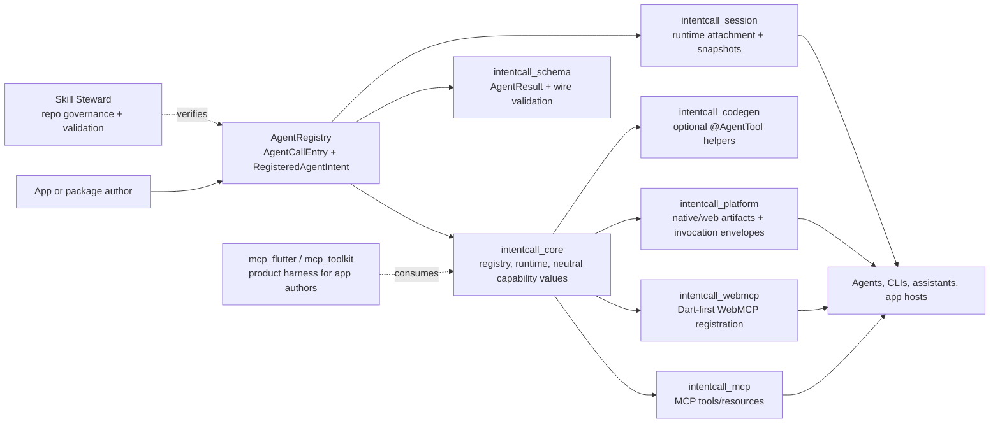
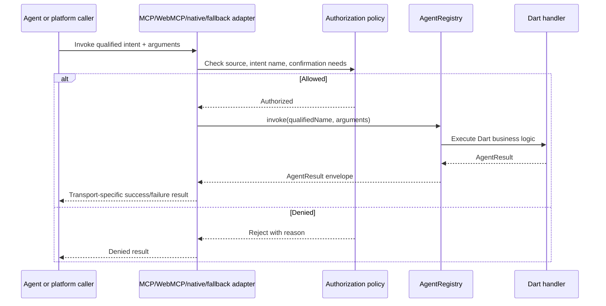

# How IntentCall Works

IntentCall gives a Dart or Flutter program one source of truth for agent-callable behavior: the `AgentRegistry`. A tool is registered once, then adapters project that registry entry into MCP, WebMCP, platform artifacts, or fallback invoke routes.

The key idea is simple: adapters publish and route calls, but Dart remains the home of application behavior.



## One Minimal Intent

This is the smallest useful shape: define a tool, register it, and invoke it through the registry. Adapters use the same registry entry instead of copying the handler into another transport.

```dart
import 'package:intentcall_core/intentcall_core.dart';
import 'package:intentcall_schema/intentcall_schema.dart';

Future<void> main() async {
  final registry = InMemoryAgentRegistry();

  registry.register(
    AgentCallEntry.tool(
      namespace: 'demo',
      name: 'ping',
      description: 'Return a pong payload.',
      inputSchema: const {
        'type': 'object',
        'properties': {
          'message': {'type': 'string'}
        }
      },
      handler: (arguments) async {
        final message = arguments['message'] as String? ?? 'pong';
        return AgentResult.success(data: {'reply': message});
      },
    ).toRegistration(),
  );

  final result = await registry.invoke(
    'demo.ping',
    const {'message': 'hello'},
  );

  print(result.data);
}
```

## Invocation Flow



Native wrappers and fallback routes should collect supported parameters, authorize the source, and dispatch an invocation envelope back to Dart. Apple App Intents wrappers currently launch or wake the app and dispatch to the Dart registry; they do not prove app-extension-hosted Dart execution or native background business logic.

## Neighboring Systems

| Surface | What it is for |
|---|---|
| IntentCall | Registry, wire contracts, adapters, platform artifact emitters, session primitives, and adapter contract tests. |
| mcp_flutter / mcp_toolkit | Product harness for Flutter app authors: CLI, runtime discovery, Flutter VM integration, inspection, and app-side bootstrap. |
| Skill Steward | Repository governance, declared actions, probes, benchmarks, and agent workflow discipline. |

For implementation routes, continue to [Choose Your Path](/start_here/choose_your_path).
