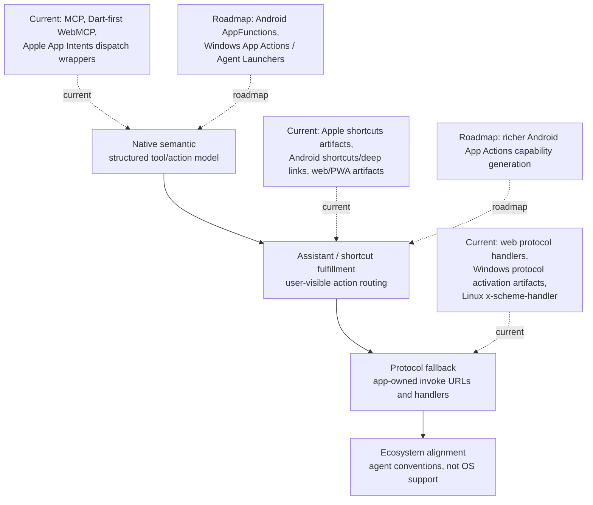

# Platform Support

IntentCall is contract-tested pre-1.0 platform infrastructure. Platform support is intentionally described by evidence level: artifact/codegen proof is not the same as live OS/runtime proof.

## Current Matrix

| Surface | Current projection | Execution location | Evidence level | Trust model | Non-claim / roadmap |
|---|---|---|---|---|---|
| MCP | `McpPublishAdapter` maps registry tools/resources to `dart_mcp`. | Dart `AgentRegistry` handler. | Shared adapter contract tests. | Transport host policy plus registry validation. | Not an LLM backend, RAG system, or Flutter runtime inspector. |
| WebMCP | Dart-first in-page registration and JS emitter/bootstrap helpers. | Dart registry when bound; optional network fallback only when configured. | Emitter/bootstrap tests. | Deny unavailable runtime by default; network fallback is opt-in. | Live browser-host interoperability needs separate proof. |
| Apple App Intents / Shortcuts | Generated parameter wrappers and artifacts. | Wrapper launches or wakes app and dispatches envelope to Dart. | Artifact/project-sync and bridge authorization tests. | `IntentCallAuthorizationPolicy`; allowlists or confirmation for sensitive calls. | No stable claim of app-extension-hosted Dart or native background business logic. |
| Android shortcuts / deep links | Manifest and shortcut/deep-link metadata. | App receives route and dispatches to Dart. | Manifest generator tests. | Treat plain deep links as untrusted unless generated wrapper or app allowlist marks source trusted. | Android AppFunctions and fuller App Actions capability generation are roadmap. |
| Windows protocol activation | Protocol activation artifacts. | App route dispatches to Dart when wired by host. | Artifact-level support. | Fallback routes are untrusted by default. | Windows App Actions / Agent Launchers are roadmap. |
| Linux `x-scheme-handler` | Desktop protocol handler artifacts for the app-owned scheme. | App route dispatches to Dart when wired by host. | Artifact-level support. | Fallback routes are untrusted by default. | No Linux OS-level native intent API claim. |
| Native/WebMCP bridge | `IntentCallInvocationEnvelope` and authorization policy. | Dart registry through `IntentCallNativeBridge.bindRegistry(...)`. | Platform bridge tests. | Deny-by-default in compiled builds; `debugAllowAll()` is local dogfood only. | Host apps own product-specific permissions and UX. |

## Claim Rule

Use “current” only for behavior covered by repo tests, generated artifacts, or documented sync helpers. Use “roadmap,” “target,” or “experiment” for Android AppFunctions, richer Android App Actions, Windows App Actions / Agent Launchers, AAIF alignment, app-extension-hosted Dart, native background Dart execution, and real OS assistant/launcher discovery.
