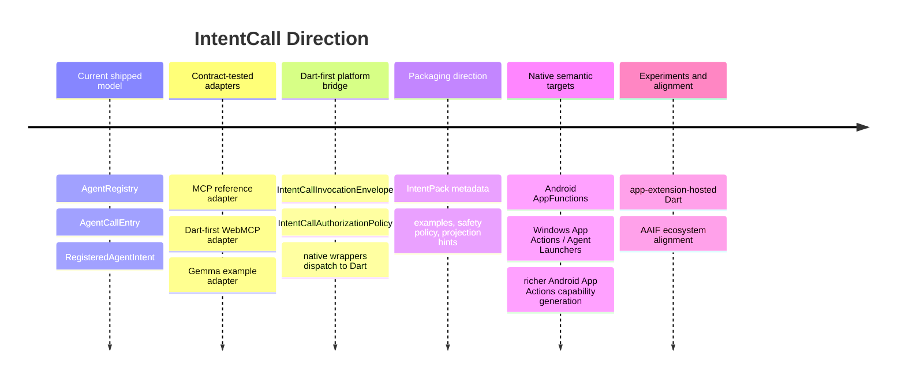

# Roadmap

This roadmap describes direction, not a stability promise. The shipped authoring model remains `AgentRegistry`, `AgentCallEntry`, and `RegisteredAgentIntent`.

## Current Stable Direction

- Keep handwritten `AgentCallEntry` registration first-class.
- Keep the registry as the behavior source of truth.
- Keep adapters thin: publish metadata, translate transport calls, and invoke the registry.
- Keep platform support tiers explicit, with artifact proof separated from live OS proof.
- Keep `IntentPack` as direction until it is a stable public API.

## Before A Production Claim

IntentCall can support production-oriented integration design today, but the packages are still pre-1.0. A real production claim needs more than package tests:

1. Pin released packages or a reviewed git ref.
2. Declare which platform support tier the app uses.
3. Use explicit `IntentCallAuthorizationPolicy` allowlists and confirmation callbacks for sensitive calls.
4. Run adapter contract tests and repo validation.
5. Prove the actual target runtime or OS surface in the consuming app.
6. Document non-claims beside the integration.
